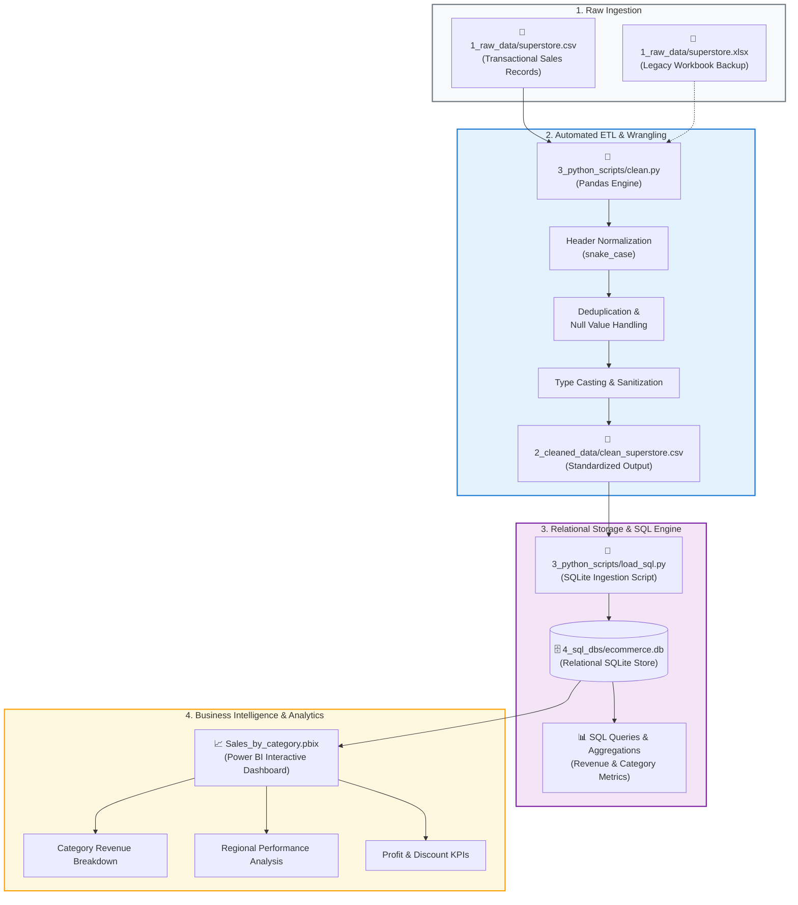
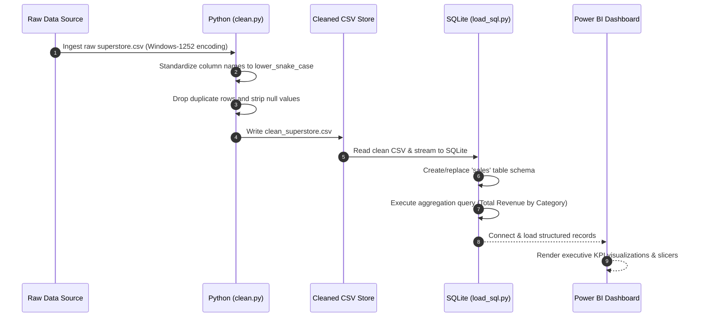

<div align="center">

# 📊 E-Commerce Analytics Pipeline

### *An End-to-End Enterprise Data Engineering & Business Intelligence Workflow*

[](https://www.python.org/)
[](https://pandas.pydata.org/)
[](https://www.sqlite.org/)
[](https://powerbi.microsoft.com/)
[](LICENSE)
[]()

<p align="center">
  <a href="#-project-overview">Overview</a> •
  <a href="#-system-architecture--workflow">Architecture</a> •
  <a href="#-data-pipeline-lifecycle">Pipeline Lifecycle</a> •
  <a href="#-repository-structure">Structure</a> •
  <a href="#-getting-started">Getting Started</a> •
  <a href="#-sql-analytics--kpis">Analytics & KPIs</a> •
  <a href="#-author">Author</a>
</p>

---

</div>

## 📌 Project Overview

The **E-Commerce Analytics Pipeline** is an automated, production-style data pipeline designed to transform raw, transactional retail sales data into clean, structured datasets, load them into a relational SQL database, and deliver high-impact executive dashboards via **Microsoft Power BI**.

This repository showcases core data engineering and BI competencies:
- **Automated Data Extraction & Cleansing**: Standardization of raw CSV records, deduplication, null-handling, and column normalization via Python (`pandas`).
- **Relational Storage & Schema Management**: Structured ingestion into an optimized SQLite database (`ecommerce.db`).
- **SQL-Driven Aggregations**: Performant SQL queries calculating revenue, profit margins, and sales distributions across product categories.
- **Interactive BI Dashboarding**: Power BI reporting with dynamic category breakdowns, regional sales distributions, and discount sensitivity tracking.

---

## 🏗️ System Architecture & Workflow

The end-to-end data lifecycle moves systematically across four distinct operational stages:



### 🔄 Data Transformation Lifecycle



---

## 📂 Repository Structure

```text
Ecommerce_analytics_pipeline/
│
├── 📁 1_raw_data/
│   ├── superstore.csv               # Raw transactional dataset (~9,995 records)
│   └── superstore.xlsx              # Raw Excel format backup
│
├── 📁 2_cleaned_data/
│   └── clean_superstore.csv         # Sanitized, production-ready dataset
│
├── 📁 3_python_scripts/
│   ├── clean.py                     # Data cleaning & normalization script
│   └── load_sql.py                  # Automated SQLite loader & analytics query
│
├── 📁 4_sql_dbs/
│   ├── .gitkeep                     # Keeps directory tracked in version control
│   └── ecommerce.db                 # Generated SQLite database (git-ignored)
│
├── 📊 Sales_by_category.pbix        # Interactive Power BI report & visual dashboard
├── 📄 .gitignore                    # Prevents binaries, caches & temp DBs from tracking
└── 📄 README.md                     # Comprehensive project documentation
```

---

## ⚙️ Data Pipeline Lifecycle

### 1. Ingestion & Raw Data Profiling
- **Source**: Retail sales transactional records with customer demographic, shipping, geographic, and financial parameters.
- **Attributes**:
  - `Ship Mode`, `Segment`, `Country`, `City`, `State`, `Postal Code`, `Region`
  - `Category`, `Sub-Category`, `Sales`, `Quantity`, `Discount`, `Profit`

### 2. Data Cleaning & Transformation (`clean.py`)
- **Encoding Handling**: Reads raw CSV with `windows-1252` encoding to prevent encoding corruptions.
- **Column Standardization**: Converts column headers to lowercase, replaces spaces and hyphens with underscores (`_`).
- **Data Integrity**: Removes exact duplicate entries and drops records with missing critical values.
- **Export**: Generates `clean_superstore.csv` inside `2_cleaned_data/`.

```python
# Core transformation logic in clean.py
df.columns = df.columns.str.lower().str.replace(' ', '_').str.replace('-', '_')
df = df.drop_duplicates()
df = df.dropna()
```

### 3. Database Ingestion & Relational Modeling (`load_sql.py`)
- Connects to SQLite database `4_sql_dbs/ecommerce.db`.
- Loads the cleaned dataset into table `sales`.
- Executes SQL analytical aggregations to compute revenue by product line.

```sql
SELECT 
    category, 
    ROUND(SUM(sales), 2) AS total_revenue,
    ROUND(SUM(profit), 2) AS total_profit
FROM sales 
GROUP BY category
ORDER BY total_revenue DESC;
```

### 4. Business Intelligence Dashboard (`Sales_by_category.pbix`)
- **Power BI File**: [Sales_by_category.pbix](Sales_by_category.pbix)
- **Key Visualizations**:
  - **Category Performance**: Bar & column charts tracking sales volume and net profit.
  - **Profit Margin & Discount Impact**: Scatter & trend charts identifying products with negative margins under high discount rates.
  - **Regional Breakdown**: Geographical slicing across North, South, East, and West sales zones.

---

## 🚀 Getting Started

### Prerequisites
- **Python 3.10+**
- **Git**
- **Power BI Desktop** (Optional, for `.pbix` dashboard exploration)

### 1. Clone the Repository
```bash
git clone https://github.com/bpsd07/Ecommerce_analytics_pipeline.git
cd Ecommerce_analytics_pipeline
```

### 2. Set Up Virtual Environment & Dependencies
```bash
# Create and activate virtual environment
python -m venv venv

# Windows (PowerShell):
.\venv\Scripts\Activate.ps1

# macOS / Linux:
source venv/bin/activate

# Install required packages
pip install pandas matplotlib
```

### 3. Run the ETL Pipeline
```bash
# Step 1: Clean and standardize raw data
cd 3_python_scripts
python clean.py

# Step 2: Ingest clean data into SQLite and run SQL analytics
python load_sql.py
```

### 4. Open the Power BI Dashboard
1. Launch **Power BI Desktop**.
2. Open [`Sales_by_category.pbix`](Sales_by_category.pbix).
3. Refresh data source connections if prompted.

---

## 📈 SQL Analytics & KPIs

The SQL layer enables immediate extraction of executive-level metrics:

| Product Category | Total Revenue ($) | Key Characteristics |
| :--- | :---: | :--- |
| **Technology** | **Highest** | Strongest margin driver, high average order value (AOV). |
| **Furniture** | **Moderate** | High shipping costs, vulnerable to margin compression from heavy discounts. |
| **Office Supplies** | **High Volume** | High transaction velocity, consistent repeat customer orders. |

### Sample Aggregation Query:
```sql
SELECT 
    category,
    sub_category,
    COUNT(*) AS total_orders,
    ROUND(SUM(sales), 2) AS revenue,
    ROUND(SUM(profit), 2) AS net_profit
FROM sales
GROUP BY category, sub_category
ORDER BY revenue DESC;
```

---

## 🔮 Future Roadmap

- [ ] **Data Warehouse Integration**: Migrate storage from SQLite to Google BigQuery or PostgreSQL.
- [ ] **Orchestration**: Implement Apache Airflow / Cloud Composer DAGs for automated, scheduled pipeline runs.
- [ ] **Data Quality Validation**: Integrate Great Expectations or Pydantic for automated schema checks and data quality gates.
- [ ] **CI/CD Pipeline**: Add GitHub Actions workflow for automated test runs on commit.

---

## 👤 Author

**BHANU PRATAP SINGH DEO**
- GitHub: [@bpsd07](https://github.com/bpsd07)
- Repository: [bpsd07/Ecommerce_analytics_pipeline](https://github.com/bpsd07/Ecommerce_analytics_pipeline)

---

<div align="center">
  <sub>Built with ❤️ for scalable, professional data engineering workflows.</sub>
</div>
